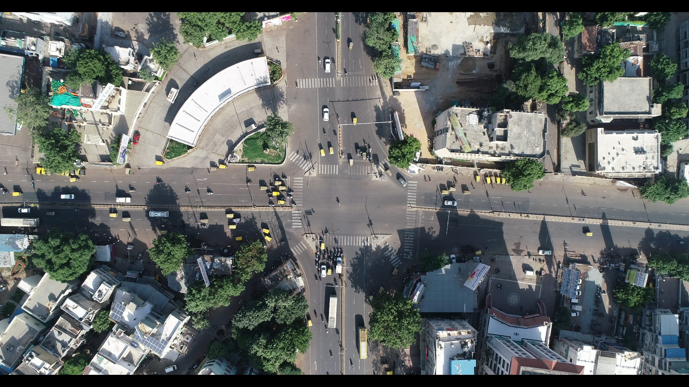

# SkyEye dataset
Dataset for analyzing lane-less traffic behavior at intersections

This work has been conducted as the part of SATREPS project entitled on “Smart Cities development for Emerging Countries by Multimodal Transport System based on Sensing, Network and Big Data Analysis of Regional Transportation” (JPMJSA1606) funded by JST and JICA. 

    

The SkyEye dataset is the first aerial dataset for monitoring intersections with mixed traffic and lane-less behavior. Around 1 hour of video each from 4 intersections, namely, Paldi (P), Nehru bridge - Ashram road (N), Swami Vivekananda bridge - Ashram road (V), and APMC market (A) in the city of Ahmedabad, India.

**Paldi (P)**         | **Nehru Bridge Ashram Road (N)** 
----------------|--------------
 |
4-way signalized intersection | 4-way signalized intersection
**Swami Vivekananda bridge - Ashram road (V)** | **APMC market (A)**
 |
7-way signalized intersection | 3-way unsignalized intersection

These intersections were considered because of the diverse
traffic conditions they present. 

The videos were captured using a DJI Phantom 4 Pro drone at 50 frames per
second in 4K resolution (4096x2160). 

<h1> Annotation </h1>
There are 50,000 frames in total with 4,021 distinct vehicle tracks
are annotated. A detailed breakdown is below:

**Number of unique vehicles**

Intersection | car | bus | 2-wheeler | auto-rickshaw | truck | van 
-|-|-|-|-|-|-
P | 175 | 54 | 881 | 494 | 45 | 16  
V | 132 | 9 | 627 | 195 | 7 | 0  
N | 41 | 8 | 275 | 99 | 12 | 6  
A | 73 | 6 | 402 | 135 | 43 | 0 

